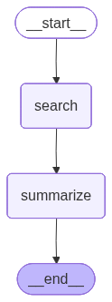

# Bio Literature Research Agent

This agent automates the process of researching scientific literature from PubMed. Provide a query, and it will find relevant papers and generate concise summaries.

## Current Workflow

The agent's workflow is managed by LangGraph. Here is the current visualization of the graph:



## How to Use

1.  **Install dependencies:**
    ```bash
    pip install -r requirements.txt
    ```

2.  **Set up your OpenAI API Key:**
    Create a `.env` file in the root of the project and add your API key:
    ```
    OPENAI_API_KEY="your_api_key_here"
    ```

3.  **Run the agent:**
    Execute the script from your terminal with a research query.

    ```bash
    python research_agent.py "your research query"
    ```

    You can also specify the number of papers to process with the `--max_results` flag:
    ```bash
    python research_agent.py "your research query" --max_results 10
    ```
